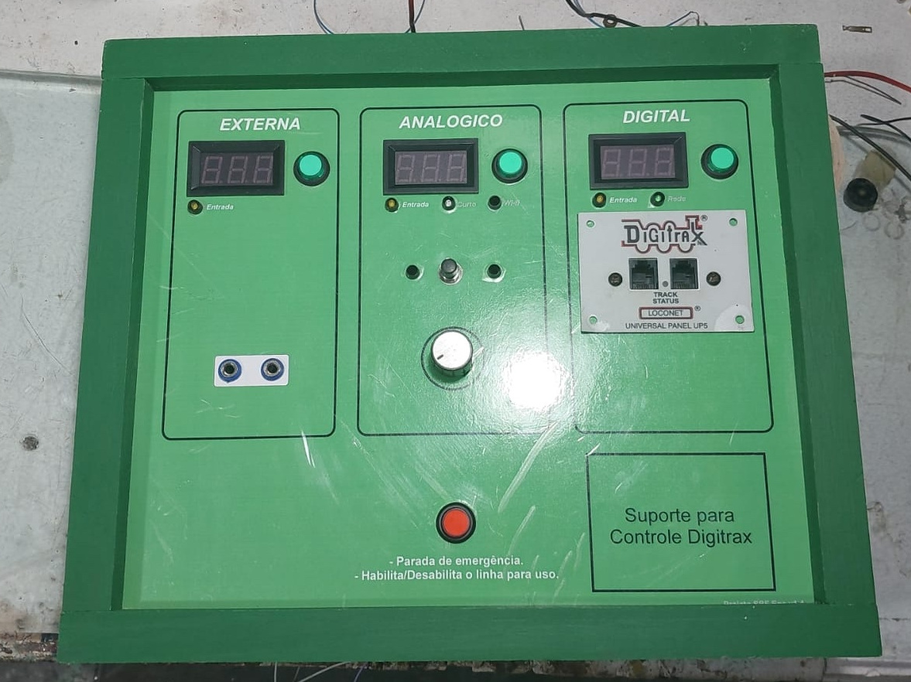
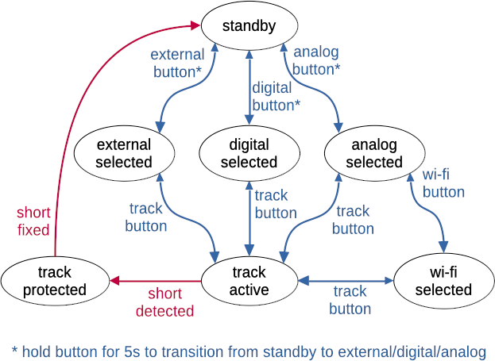

# sbf-painel

Código para um painel de controle de fontes para a SBF, Associação Brasileira de Ferromodelismo.

## Diagrama de estados do painel

Nota: Além dos controles visíveis,
o painel tem um jumper interno de manutenção que precisa estar conectado a GND para habilitar o painel.
Quando este jumper é desconectado, todos os leds e relés são desligados
e os botões não têm efeito.

### Estados

#### `standby`

* `external_led`, `digital_led`, `analog_led` piscando;
* `track_led` e `wifi_led` desligados;
* todos os relés desligados;
* transições:
  * para `external_selected`, `digital_selected`, `analog_selected` ou `wifi_selected` após segurar o botão correspondente por 5s;

#### `external_selected`

* `external_led` ligado, todos os demais desligados;
* `external_relay` ligado, todos os demais desligados;
* transições:
  * para `track_active` ao pressionar `track_button`;
  * para `standby` ao pressionar `external_button`;

#### `digital_selected`

* `digital_led` ligado, todos os demais desligados;
* `digital_relay` ligado, todos os demais desligados;
* transições:
  * para `track_active` ao pressionar `track_button`;
  * para `standby` ao pressionar `digital_button`;

#### `analog_selected`

* `analog_led` ligado, todos os demais desligados;
* `analog_relay` ligado, todos os demais desligados;
* transições:
  * para `track_active` ao pressionar `track_button`;
  * para `standby` ao pressionar `analog_button`;

#### `wifi_selected`

* `wifi_led` e `analog_led` ligados, todos os demais desligados;
* `wifi_relay` ligado, todos os demais desligados;
* transições:
  * para `track_active` ao pressionar `track_button`;
  * para `standby` ao pressionar `analog_button`;

#### `track_active`

* `track_led` ligado;
* `track_relay` ligado;
* estados mantidos:
  * led da fonte selecionada ligado (2 leds no caso de `wifi_selected`), demais desligados;
  * relé da fonte selecionada ligado, demais relés desligados;
* transições:
  * **parada de emergência**: transição para estado `*_selected` anterior ao pressioar `track_button`;
  * **curto circuito**: transição para `track_protected` se o pino `short_detected` mudar para LOW;

#### `track_protected`

* `track_led` piscando;
* todos os relés desligados;
* estados mantidos:
  * led da fonte selecionada ligado (2 leds no caso de `wifi_selected`), demais desligados;
* transição:
  * **curto resolvido**: transição para estado `*_selected` anterior se o pino `short_detected` mudar para HIGH;
