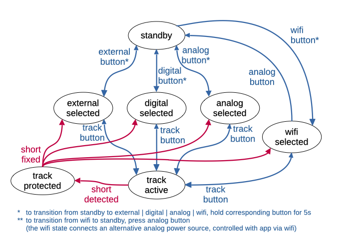

# sbf-painel

Código para um painel de controle de fontes para a SBF, Associação Brasileira de Ferromodelismo.

## Diagrama de estados do painel

Nota: Além dos controles visíveis, o painel tem um jumper interno de manutenção que precisa estar conectado a GND para habilitar o painel.
Quando este jumper é desconectado, todos os leds e relés são desligados
e os botões não têm efeito.

### Estados

#### `standby`

* `external_led`, `digital_led`, `analog_led`, piscando;
* `track_led` e `wifi_led` desligados;
* todos os relés desligados;
* transição para `external_selected`, `digital_selected`, ou `analog_selected` após segurar o botão correspondente por 5s;

#### `external_selected`

* `external_led` ligado, todos os demais desligados;
* `external_relay` ligado, todos os demais desligados;
* transições:
  * para `standby` ao pressionar `external_button`;
  * para `track active` ao pressionar `track`;

#### `digital_selected`

* `digital_led` ligado, todos os demais desligados;
* `digital_relay` ligado, todos os demais desligados;
* transições:
  * para `standby` ao pressionar `digital_button`;
  * para `track active` ao pressionar `track_button`;

#### `analog_selected`

* `analog_led` ligado, todos os demais desligados;
* `analog_relay` ligado, todos os demais desligados;
* transições:
  * para `standby` ao pressionar `analog_button`;
  * para `wifi_selected` ao pressionar `wifi_button`;
  * para `track_active` ao pressionar `track_button`;

#### `wifi_selected`

* `wifi_led` e `analog_led` ligados, todos os demais desligados;
* `wifi_relay` ligado, todos os demais desligados;
* transições:
  * para `standby` ao pressionar `analog_button`;
  * para `analog_selected` ao pressionar `wifi_button`;
  * para `track_active` ao pressionar `track_button`;

### `track active`

* `track_led` ligado;
* led e relé da fonte selecionada ligados (dois leds no caso de `wifi_selected`), demais desligados;
* transição para `track_protected` se o pino `sort_detected` mudar para LOW (?);

### `track_protected`

* `track_led` piscando;
* led da fonte selecionada ligado (dois leds no caso de `wifi_selected`), demais desligados;
* todos os relés desligados;
* transição para `standby` se o pino `sort_detected` mudar para HIGH (?);
